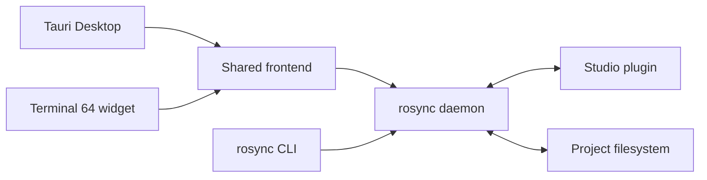

<p align="center">
  
</p>

<h1 align="center">Ro Sync</h1>

<p align="center">
  <strong>A local-first Roblox Studio control plane for humans and coding agents.</strong><br />
  Sync scripts, inspect the live DataModel, capture models and UI, drive playtests,
  and lint with Studio-aware types — all from one CLI.
</p>

<p align="center">
  <a href="https://github.com/Pugbread/ro-sync/actions/workflows/ci.yml"></a>
  <a href="https://github.com/Pugbread/ro-sync/releases"></a>
  
  
</p>

<p align="center">
  <a href="#quick-start">Quick start</a> ·
  <a href="#the-agent-loop">Agent loop</a> ·
  <a href="#sync-model">Sync model</a> ·
  <a href="#capture">Capture</a> ·
  <a href="#playtests">Playtests</a> ·
  <a href="docs/client-commands.md">Command reference</a>
</p>

## One engine, three surfaces

The Studio plugin, wire protocol, and daemon are identical in every mode — the
desktop app and widget are views over the same engine, and a shared registry
keeps them from launching competing processes for one project.

| Surface | Best for |
| --- | --- |
| **Ro Sync Desktop** | A standalone control center with installers and signed auto-updates |
| **Terminal 64 widget** | Terminal-native project management and session spawning |
| **CLI only** | LLMs, automation, CI, and minimal installs — one binary plus the plugin |

## Highlights

- **LLM-first commands** — focused, JSON-friendly operations instead of a giant
  tool registry or opaque editor automation.
- **Live Studio truth** — query Models, Parts, UI, attributes, tags, selection,
  enums, and output through the connected plugin.
- **Safe filesystem sync** — only folders and Luau scripts round-trip; every
  other class stays Studio-authoritative. First-connect divergence always asks,
  and can transfer just the paths you choose.
- **Cross-project clipboard** — copy native instance trees from one connected
  project and paste them into another, references intact, one Undo.
- **Native capture** — render isolated models, exact camera views, transparent
  icons, or a single UI subtree with no screenshot permission needed.
- **Playtest agents** — run scripted playtests that stream events, probe UI,
  send input, and capture PlayServer or PlayClient contexts.
- **Lint parity** — `luau-lsp` with a live DataModel sourcemap plus `-O0/-O1/-O2`
  compiles to catch compiler-only failures.
- **Auditable mutation** — guarded writes, change-history waypoints, versioned
  workflows, and an append-only local write log.

## Quick start

### Desktop

Grab the installer for your platform from
[Releases](https://github.com/Pugbread/ro-sync/releases), or run from source:

```sh
git clone https://github.com/Pugbread/ro-sync.git
cd ro-sync/desktop && npm ci && npm run dev
```

In the app: **Settings → Studio plugin → Install**, restart Studio, pick a
**Projects folder**. Add existing folders from **Projects**, or click
**Connect → Create Project** in the Studio plugin and Ro Sync creates the
matching project and starts its daemon automatically. Desktop serves multiple
projects at once, each with an independent daemon and Studio connection.

### Terminal 64 widget

```sh
git clone https://github.com/Pugbread/ro-sync.git ~/.terminal64/widgets/ro-sync
```

Open Terminal 64, select Ro Sync, add a project folder, and flip its serving
switch. (Windows: clone to `%USERPROFILE%\.terminal64\widgets\ro-sync`.)

### CLI only

Download a platform bundle from
[Releases](https://github.com/Pugbread/ro-sync/releases), put `rosync` on your
`PATH`, then:

```sh
rosync plugin install
rosync init --project /path/to/game
rosync daemon start --project /path/to/game --raw
```

`rosync serve` keeps a foreground daemon for launchd, systemd, containers, or a
dev terminal.

## The agent loop

Discovery stays cheap and precise — read only what the task needs, write with
guardrails, verify what you touched:

```sh
rosync context --project .                                   # one compact environment read
rosync tree --project . --path ReplicatedStorage --depth 3   # inspect
rosync query --project . 'StarterGui/**/TextButton' --format paths

rosync set --project . --path Workspace/Camera \
  --prop FieldOfView --value 80 --waypoint "camera pass"     # guarded write, one Undo

rosync lint --project . --path ReplicatedStorage/Shared --summary
```

Move native content between two served projects without exporting a model:

```sh
rosync copy --project . Workspace/Map/Boss    # in the source project
rosync paste --project . --to Workspace/Imported    # in the destination
```

`rosync commands --compact` lists command families;
[docs/client-commands.md](docs/client-commands.md) is the full generated
reference. Versioned, assertion-checked multi-step workflows run through
`rosync run --file workflow.json`.

## Sync model

Ro Sync deliberately mirrors a narrow projection of the DataModel:

| On disk | In Studio | Direction |
| --- | --- | --- |
| `Foo.luau` | `ModuleScript` named `Foo` | Two-way |
| `Foo.server.luau` | `Script` named `Foo` | Two-way |
| `Foo.client.luau` | `LocalScript` named `Foo` | Two-way |
| `Folder/` | `Folder` | Two-way |
| Everything else (Parts, Models, UI, Remotes, …) | Studio instances | Studio-authoritative; inspect or mutate through the CLI |

Scripts with children use an `init (Name).*` file inside a matching directory;
duplicate sibling names get deterministic `[N]` suffixes; renames and moves stay
renames and reparents.

When both sides differ on first connect, Ro Sync always asks before writing:
**Keep Studio** does one clean Studio→disk overwrite, while **Choose files**
lets you move individual divergent paths into the Studio queue and leaves the
rest untouched.

## Capture

The packaged Photo engine needs no screenshot permission and no code inside the
game:

```sh
rosync capture photo --project . \
  --focus Workspace/Map/Boss --view isometric \
  --size 1024x1024 --background transparent \
  --output ./captures/boss.png --raw
```

Isolated captures tight-crop to the subject's alpha by default; `--camera-cframe`
reproduces an exact authored view and `--ui-target` isolates one UI subtree.
Camera, lighting, and UI state are restored after success or failure.

## Playtests

One command wraps the whole Studio playtest lifecycle: start, inject a
playscript, stream its events, print the result, stop.

```sh
rosync playtest run --project . \
  --script ./bench.server.luau \
  --client-script ./join.client.luau \
  --mode multiplayer --players 2 \
  --args '{"map":"Lighthouse","laps":3}' --raw
```

Playscripts get a `playtest.*` API for args, signals, progress events, and
completion; `--raw` streams live NDJSON with distinct exit codes per outcome.
See the [queue-and-lap benchmark](docs/examples/playtest-run/README.md) for a
complete example, or use the lower-level `playtest start/exec/ui/capture/stop`
commands for custom orchestration. Runtime changes never sync back to disk or
edit mode.

## Safety model

- Daemons are identified by canonical project path plus a fresh boot ID, and
  managed shutdown is authenticated — stale PID records are never trusted.
- Browser-backed clients need an allowlisted local origin and an owner
  capability; the desktop renderer has no unrestricted shell access.
- Raw `Parent` writes are refused (`rosync mv` instead), cross-service moves
  require `--force`, and every Studio write lands in an append-only local log.

Reporting and trust boundaries: [SECURITY.md](SECURITY.md).

## Architecture



Full component and lifecycle model: [docs/ARCHITECTURE.md](docs/ARCHITECTURE.md).

## Platforms

| Platform | Desktop | CLI / daemon | Terminal 64 | Studio plugin |
| --- | --- | --- | --- | --- |
| macOS Apple Silicon | ✅ | ✅ | ✅ | ✅ |
| Windows x86_64 | ✅ | CI-gated | Command-checked | ✅ |
| Linux x86_64 | Buildable | ✅ | ✅ | Studio is not native |

Release bundles include the checksum-pinned Luau compiler used by
`rosync lint`.

## Documentation

- [Command reference](docs/client-commands.md) — generated, machine-readable
- [Desktop install and release artifacts](docs/DESKTOP.md)
- [Architecture](docs/ARCHITECTURE.md)
- [Plugin protocol and schema](plugin/SCHEMA.md) · [plugin development](plugin/README.md)
- [Contributing](CONTRIBUTING.md) · [release verification](VERIFICATION.md)

Served projects also get generated `ro-sync.md`, `AGENTS.md`, `CLAUDE.md`, and
`.codex/config.toml` agent docs; refresh them after upgrades with
`rosync refresh --project .`.

## Development

```sh
cd daemon && cargo fmt --check && cargo test --locked \
  && cargo clippy --locked --all-targets -- -D warnings   # Rust gates
cd desktop && npm ci && npm run check                     # desktop host
node plugin/build-plugin.mjs                              # deterministic plugin build
```

CI mirrors these plus the frontend policy checks — see
[CONTRIBUTING.md](CONTRIBUTING.md).

---

<p align="center">
  Ro Sync is under active development. Protocol compatibility, deterministic
  artifacts, and safe local automation take priority over a broad sync surface.
</p>
