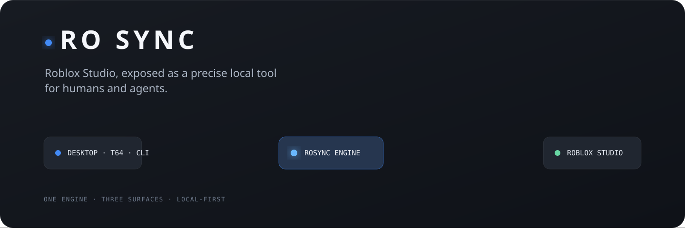
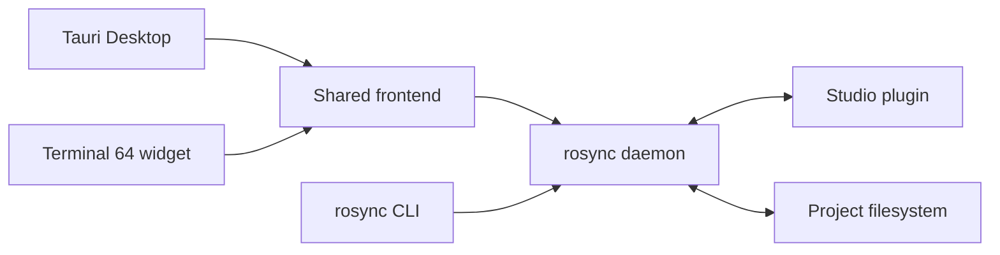

<p align="center">
  
</p>

<h1 align="center">Ro Sync</h1>

<p align="center">
  <strong>A local-first Roblox Studio control plane for humans and coding agents.</strong><br />
  Sync scripts, inspect the live DataModel, capture UI and models, drive playtests, lint with Studio-aware types, and compose verified workflows from one CLI.
</p>

<p align="center">
  <a href="https://github.com/Pugbread/ro-sync/actions/workflows/ci.yml"></a>
  <a href="https://github.com/Pugbread/ro-sync/releases"></a>
  
  
</p>

## Choose your surface

Ro Sync is one engine with three interchangeable ways to run it. The Studio
plugin and wire protocol are identical in every mode.

| Surface | Best for | What ships |
| --- | --- | --- |
| **Ro Sync Desktop** | A focused standalone control center | Tauri app, shared UI, `rosync` sidecar, Studio plugin, command docs, Luau tools |
| **Terminal 64 widget** | Terminal-native project management and session spawning | The same shared UI through the Terminal 64 host adapter |
| **CLI only** | LLMs, automation, CI, and minimal installations | One `rosync` binary plus the Studio plugin |

The desktop app and widget are views over the engine—not separate sync
implementations. A shared daemon registry prevents the surfaces from launching
competing processes for the same project.

## Why Ro Sync

- **LLM-first commands.** Focused JSON-friendly operations instead of a giant
  tool registry or opaque editor automation.
- **Live Studio truth.** Query Models, Parts, UI, attributes, tags, selection,
  enums, methods, output, and script source through the connected plugin.
- **Cross-project Studio clipboard.** Copy arbitrary native instance trees in
  one connected project, change directories, and paste them into another with
  internal references intact and the full paste grouped into one Undo.
- **Safe filesystem sync.** Only folders and Luau scripts round-trip; every
  other class remains Studio-authoritative.
- **Native capture.** Render isolated models, exact camera views, transparent
  icons, viewport regions, complete UI, or one UI subtree without a place-owned
  screenshot dependency.
- **Runtime playtest agents.** Execute bounded probes, inspect UI, send virtual
  input, read logs, and capture PlayServer or PlayClient contexts.
- **Lint parity.** Run `luau-lsp` with a live DataModel sourcemap and compile at
  `-O0`, `-O1`, and `-O2` to catch compiler-only failures such as Luau's
  register limit.
- **Auditable mutation.** Structured writes, assertions, change-history
  waypoints, workflows, and an append-only local write log.

## Five-minute start

### Desktop app

Tagged releases publish platform installers. To run the desktop app from source:

```sh
git clone https://github.com/Pugbread/ro-sync.git
cd ro-sync/desktop
npm ci
npm run dev
```

Open **Settings → Studio plugin**, install the bundled plugin, restart Studio,
then choose a **Projects folder** in Settings. You can add existing folders from
**Projects**, or open a published place in Studio and click **Connect → Create
Project** in the plugin. Studio sends its universe, place, creator, group, and
display metadata to the desktop broker; Ro Sync creates or reuses the matching
folder below the authorized root and starts its managed daemon automatically.

Desktop can serve several projects at once. Each Projects-row switch owns an
independent daemon, port, Studio connection, and authenticated lifecycle claim;
selecting another row only changes the focused project. Stopping one switch or
quitting Desktop never kills CLI-owned daemons or another project's process.

### Terminal 64 widget

```sh
mkdir -p ~/.terminal64/widgets
git clone https://github.com/Pugbread/ro-sync.git \
  ~/.terminal64/widgets/ro-sync
```

Open Terminal 64, select Ro Sync, add a project folder, and turn on its serving
switch. Windows users can clone to
`%USERPROFILE%\.terminal64\widgets\ro-sync`.

### CLI only

Download the platform bundle from
[GitHub Releases](https://github.com/Pugbread/ro-sync/releases), put `rosync` on
your `PATH`, then initialize and manage a project without a frontend:

```sh
rosync init --project /path/to/game
rosync daemon start --project /path/to/game --raw
rosync daemon status --project /path/to/game --raw
```

Install or verify the Studio plugin from the command line:

```sh
rosync plugin install
rosync plugin status --raw
```

Keep `rosync serve --project /path/to/game --port 7878` for foreground use
under launchd, systemd, Task Scheduler, containers, or a development terminal.

## The agent loop

Ro Sync keeps discovery cheap and precise:

```sh
# One compact environment read
rosync context --project .
rosync capabilities --project . --raw

# Inspect only what the task needs
rosync tree --project . --path ReplicatedStorage --depth 3
rosync get --project . --path Workspace/Camera --prop FieldOfView
rosync query --project . 'StarterGui/**/TextButton' --format paths

# Make a guarded change and verify it
rosync set --project . --path Workspace/Camera \
  --prop FieldOfView --value 80 --waypoint "camera pass"
rosync get --project . --path Workspace/Camera --prop FieldOfView

# Check touched code with Studio-aware types and compiler coverage
rosync lint --project . --path ReplicatedStorage/Shared --summary
```

Move native Studio content between two served projects without exporting a
model by hand:

```sh
cd /path/to/source
rosync copy --project . Workspace/Map/Boss ReplicatedStorage/BossConfig

cd /path/to/destination
rosync paste --project . --to Workspace/Imported
```

With no paths, `copy` uses the current Explorer selection. With no `--to`,
`paste` restores each root beneath its recorded parent route, including legal
names containing `/` and duplicate same-named siblings. Roblox's native
serializer carries arbitrary engine-supported instance hierarchies, scripts,
attributes, tags, and references between roots copied together.

Use `rosync commands --compact` to choose a command family and
`rosync commands <name>` for exact machine-readable usage. The full generated
reference lives in [docs/client-commands.md](docs/client-commands.md).

## Sync model

Ro Sync deliberately mirrors a narrow projection of the DataModel:

| On disk | In Studio | Direction |
| --- | --- | --- |
| `Foo.luau` | `ModuleScript` named `Foo` | Two-way |
| `Foo.server.luau` | `Script` named `Foo` | Two-way |
| `Foo.client.luau` | `LocalScript` named `Foo` | Two-way |
| `Folder/` | `Folder` | Two-way |
| Parts, Models, UI, Remotes, Sounds, attributes, tags | Studio instances | Studio-authoritative; inspect or mutate through CLI |

Scripts with children use an `init (Name).*` file inside a matching directory.
Duplicate sibling names use deterministic `[N]` suffixes. Renames and moves
remain instance renames and reparents when they stay inside a synced service.

## Capture and visual QA

The locally packaged Photo engine does not need screenshot permission or a
capture module inside the game:

```sh
# Isolated model icon; visible alpha is tight-cropped by default
rosync capture photo --project . \
  --focus Workspace/Map/Boss --view isometric \
  --size 1024x1024 --background transparent \
  --output ./captures/boss.png --raw

# Exact authored view
rosync capture photo --project . \
  --focus Workspace/Vehicle \
  --camera-cframe '0,10,20,1,0,0,0,1,0,0,0,1' \
  --fov 40 --size 1600x900 --output ./captures/vehicle.png --raw

# One UI element and its descendants; unrelated UI is hidden
rosync capture photo --project . \
  --ui-target StarterGui/HUD/InventoryPanel \
  --size 1200x800 --output ./captures/inventory.png --raw
```

Camera, lighting, and UI state are restored after success or failure. Raw RGBA
travels through bounded artifact chunks and is length- and hash-checked before
the local PNG is written.

## Playtest automation

For agent automation, a playscript-owned run wraps the complete Studio playtest lifecycle
in one foreground command. The main script can stream structured events, wait
for clients and cross-context signals, then return its final report; Ro Sync
prints the result and stops the playtest before returning to the shell:

```sh
rosync playtest run --project . \
  --script ./bench.server.luau \
  --client-script ./join.client.luau \
  --mode multiplayer --players 2 \
  --args '{"map":"Lighthouse","laps":3}' \
  --timeout 600 --raw
```

Raw mode is live NDJSON. Main return/`playtest.done` exits 0, script failure
exits 2, timeout exits 3, an externally ended job exits 4 with its final job
status, and boot failure exits 5. `--keep-open` retains the job for manual
`exec`, `logs`, or `capture` inspection. Encoded results are capped at 1 MiB;
large telemetry belongs in `playtest.emit` events.

See the [canonical queue-and-lap benchmark](docs/examples/playtest-run/README.md)
for complete server/client scripts and the playscript runtime API.

The lower-level asynchronous job commands remain available for interactive or
custom orchestration:

```sh
rosync playtest start --project . --mode multiplayer --players 2 --wait --raw
rosync playtest exec --project . --context server \
  --source 'return #game.Players:GetPlayers()' --identity game --raw
rosync playtest ui --project . --context client:1 --class TextButton --raw
rosync playtest capture --project . --context client:1 \
  --output ./captures/client-1.png --raw
rosync playtest stop --project . --raw
```

Runtime changes remain inside the temporary PlayServer or PlayClient DataModel
and never sync to disk or persist back into edit mode. Game identity is the
default; plugin identity is an explicit sandbox escape hatch and cannot require
game modules.

## Versioned workflows

`rosync run` validates schema version 1 before executing a sequence over one
persistent remote session. Workflows support reads, writes, assertions, waits,
captures, playtests, uploads, idempotency keys, expected classes and place IDs,
and contiguous change-history transactions.

```json
{
  "version": 1,
  "expectedMode": "edit",
  "steps": [
    {
      "id": "read",
      "op": "get",
      "path": "Workspace/Camera",
      "property": "FieldOfView"
    },
    {
      "id": "check",
      "op": "assert",
      "actual": "$read.value",
      "check": { "op": "gte", "expected": 40 }
    }
  ]
}
```

```sh
rosync run --project . --file workflow.json --dry-run
rosync run --project . --file workflow.json --raw
```

## Safety model

- Every daemon is identified by its canonical project path and a fresh boot ID.
- A command refuses to reuse a listener serving a different project.
- Managed shutdown is authenticated; Ro Sync never trusts a stale PID record by
  itself.
- Browser-backed clients need an allowlisted local origin and an owner
  capability. The Tauri renderer has no unrestricted shell access.
- Raw `Parent` writes are refused; use `rosync mv`. Cross-service moves require
  `--force`.
- Temporary capture clones and playtest agents are bounded and cleaned up.
- Studio writes are recorded in the platform Ro Sync data directory.

See [SECURITY.md](SECURITY.md) for reporting and trust-boundary details.

## Architecture



The complete component and lifecycle model is documented in
[docs/ARCHITECTURE.md](docs/ARCHITECTURE.md).

## Platform support

| Platform | Desktop | CLI / daemon | Terminal 64 | Studio plugin install |
| --- | --- | --- | --- | --- |
| macOS Apple Silicon | Supported | Supported | Supported | Supported |
| Windows x86_64 | Supported | CI-gated | Command-checked | Supported |
| Linux x86_64 | Buildable | Supported | Supported | Studio is not native |

Release bundles also contain the checksum-pinned Luau compiler used by the
compiler stage of `rosync lint`.

## Documentation

- [Complete command reference](docs/client-commands.md)
- [Desktop installation and release artifacts](docs/DESKTOP.md)
- [Architecture](docs/ARCHITECTURE.md)
- [Studio plugin protocol and schema](plugin/SCHEMA.md)
- [Studio plugin development](plugin/README.md)
- [Contribution guide](CONTRIBUTING.md)
- [Release verification](VERIFICATION.md)

Ro Sync also generates an LLM-oriented `ro-sync.md`, `AGENTS.md`, `CLAUDE.md`,
and `.codex/config.toml` inside served projects. Run `rosync refresh --project .`
after upgrading to update those generated instructions without replacing custom
project notes.

## Development

Rust release gates:

```sh
cd daemon
cargo fmt --check
cargo test --locked
cargo clippy --locked --all-targets -- -D warnings
```

Shared frontend, generated docs, and plugin:

```sh
node --check app.js
node --check bridge.js
node --check lifecycle-policy.js
node scripts/check-host-adapter.mjs
node scripts/check-lifecycle-policy.mjs
node scripts/check-platform-commands.mjs
node scripts/build-command-docs.mjs
node scripts/check-luau-bytecode.mjs plugin/Plugin.luau
node plugin/build-plugin.mjs
```

Desktop:

```sh
cd desktop
npm ci
npm run check
npm run build
```

See [CONTRIBUTING.md](CONTRIBUTING.md) before opening a pull request.

## Repository map

```text
daemon/       Rust engine, daemon, CLI, and lifecycle manager
desktop/      Tauri shell, native host commands, packaging, and app icons
views/        Shared Projects, Activity, Conflicts, Docs, and Settings views
plugin/       Built Studio plugin and protocol source
plugin-src/   Rojo/Wally project for the Studio plugin interface
docs/         Architecture and generated command reference
scripts/      Deterministic build and verification helpers
tools/        Optional pinned Luau and luau-lsp tooling
```

Ro Sync is under active development. Protocol compatibility, deterministic
artifacts, and safe local automation take priority over a broad sync surface.
